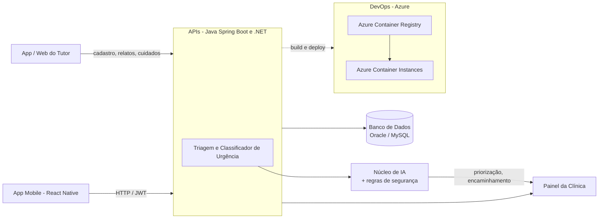

# Zelo — cuidado contínuo antes da urgência

**Projeto Zelo** — Challenge 2026, FIAP (Análise e Desenvolvimento de Sistemas, 2º ano, 2º semestre), em parceria com a **CLYVO VET**.


## Sumário

- [Sobre o projeto](#sobre-o-projeto)
- [O Ciclo Zelo](#o-ciclo-zelo)
- [Arquitetura](#arquitetura)
- [Stack tecnológica](#stack-tecnológica)
- [Estrutura do repositório](#estrutura-do-repositório)
- [Disciplinas do Challenge e entregas](#disciplinas-do-challenge-e-entregas)
- [Como executar cada módulo](#como-executar-cada-módulo)
- [Equipe](#equipe)

## Sobre o projeto

Muitos tutores só procuram a clínica veterinária quando a situação já é urgente ou quando existe um lembrete óbvio, como o da vacinação. Entre uma consulta e outra, cuidados preventivos, retornos, medicamentos e mudanças de rotina acabam esquecidos ou percebidos tarde demais.

O **Zelo** existe para mudar essa lógica. É um sistema operacional de cuidado contínuo para pets que conecta tutor, clínica veterinária e inteligência artificial, acompanhando a saúde do animal ao longo do tempo — antes da urgência, não depois dela.

A solução é formada por três partes integradas:

- **Aplicativo/ambiente web do tutor** — cadastro do pet, linha do tempo de saúde, próximos cuidados, respostas rápidas sobre a rotina e conversa com o assistente inteligente.
- **Painel da clínica** — pets acompanhados, fila de atenção, histórico autorizado e encaminhamentos que precisam de resposta profissional.
- **Núcleo de inteligência** — interpreta relatos, identifica prioridades, personaliza a comunicação e apoia a conexão entre tutor e clínica, sempre dentro de regras de segurança.

A abordagem é híbrida: a inteligência artificial contribui com linguagem natural, personalização e priorização; as regras de segurança definem os limites do sistema, verificam sinais de alerta e determinam quando o caso precisa ser encaminhado à clínica.

> A IA apoia a interpretação de relatos e a personalização da comunicação, mas **não confirma diagnósticos, não prescreve medicamentos e não substitui o médico veterinário**. Havendo risco, dúvida ou pedido do tutor, o contato humano é sempre priorizado.

### MVP e evolução

O MVP prioriza os fluxos essenciais: cadastro e autenticação, cadastro do pet, linha do tempo, plano de cuidado, acompanhamento rápido, interpretação de relatos, priorização, encaminhamento humano e painel da clínica. Funcionalidades como comércio eletrônico, hotelaria, rede social e novas integrações fazem parte da evolução planejada e não substituem o núcleo de cuidado contínuo.

O impacto da solução é acompanhado por indicadores como retenção de usuários em 90 dias, adesão a cuidados preventivos, respostas ao acompanhamento, reativação antes de uma urgência, tempo de encaminhamento e satisfação do tutor.

## O Ciclo Zelo

O principal diferencial da solução é o **Ciclo Zelo**, criado para incentivar o cuidado contínuo sem gerar pressão ou excesso de mensagens:

1. Após um cadastro ou consulta, o sistema organiza um plano de ações simples.
2. O tutor recebe uma orientação objetiva e confirma o que foi realizado.
3. O progresso do pet fica visível ao longo do tempo.
4. Se o tutor deixa de interagir, recebe uma retomada respeitosa, com opção de pausar.
5. A clínica pode oferecer conteúdos, prioridade de agenda ou benefícios associados aos cuidados recomendados.

## Arquitetura



## Stack tecnológica

| Módulo | Stack |
|---|---|
| `backend-java/` | Java 17, Spring Boot 3.3, Spring Security, Flyway |
| `backend-dotnet/` | .NET 8, ASP.NET Core, Entity Framework Core + Oracle, JWT, Serilog, xUnit |
| `mobile/` | Expo SDK 54, React Native 0.81, TypeScript, Expo Router, TanStack Query |
| `devops/` | Docker, Azure Container Registry (ACR), Azure Container Instances (ACI), MySQL |
| `database/` | Oracle PL/SQL (procedimentos, funções, trigger de auditoria) |
| `ai-iot/` | Classificação de urgência/priorização, documentação de datasets de apoio |

## Estrutura do repositório

Ao longo do semestre, cada integrante desenvolveu a entrega de uma disciplina em um repositório próprio. Para a entrega final, unificamos tudo aqui, preservando o histórico de commits original de cada um dentro da pasta correspondente:

| Pasta | Disciplina | Repositório original |
|---|---|---|
| [`backend-java/`](backend-java) | Java Advanced | [GabrielRobertoni/zelo-java](https://github.com/GabrielRobertoni/zelo-java) |
| [`backend-dotnet/`](backend-dotnet) | Advanced Business Development with .NET | [lopesadvisory/zelo-dotnet-sprint3](https://github.com/lopesadvisory/zelo-dotnet-sprint3) |
| [`devops/`](devops) | DevOps Tools & Cloud Computing | [brunoferr10/zelo-devops](https://github.com/brunoferr10/zelo-devops) |
| [`mobile/`](mobile) | Mobile Application Development | [Nicolas-Ramiro/zelo-mobile](https://github.com/Nicolas-Ramiro/zelo-mobile) |
| [`database/`](database) | Mastering Relational and Non-Relational Database | modelagem, script PL/SQL (Oracle) e documentação técnica |
| [`ai-iot/`](ai-iot) | Disruptive Architectures: IoT, IoB & Generative AI | documentação do componente de IA e datasets de apoio |

Cada pasta tem seu próprio `README.md`, com instruções específicas de instalação, execução e demonstração daquela disciplina.

## Disciplinas do Challenge e entregas

| Disciplina | Onde encontrar |
|---|---|
| Java Advanced | [`backend-java/`](backend-java) |
| Advanced Business Development with .NET | [`backend-dotnet/`](backend-dotnet) |
| DevOps Tools & Cloud Computing | [`devops/`](devops) |
| Mobile Application Development | [`mobile/`](mobile) |
| Mastering Relational and Non-Relational Database | [`database/`](database) |
| Disruptive Architectures: IoT, IoB & Generative AI | [`ai-iot/`](ai-iot) |
| Compliance, Quality Assurance & Tests | entregue via link de acesso ao Azure Boards (plano de projeto, testes manuais e automação), sem código versionado neste repositório |

## Como executar cada módulo

Cada módulo é independente e tem instruções completas no seu próprio README. Resumo rápido:

```bash
# backend-java (Spring Boot)
cd backend-java && ./mvnw spring-boot:run

# backend-dotnet (ASP.NET Core)
cd backend-dotnet/ZeloApi.Net && dotnet run

# mobile (Expo)
cd mobile && npm install && npm start

# devops (build e deploy completos na Azure)
cd devops && ./scripts/00-configurar-ambiente.sh
```

Para banco de dados, Swagger, variáveis de ambiente, testes e deploy na nuvem, consulte o README de cada pasta.

## Observação sobre o dataset de IA

O dataset de imagens usado como referência para a disciplina de IA soma cerca de 650 MB e não foi incluído neste repositório. Em [`ai-iot/README.md`](ai-iot/README.md) está a documentação completa da abordagem, com os artefatos tabulares e descritivos mais leves.

## Equipe

| Integrante | RM |
|---|---|
| Bruno Ferreira | 563489 |
| Gabriel Robertoni Padilha | 566293 |
| Hebert Lopes do Santos | 563192 |
| Marcus Vinícius Vila Nova da Silva | 558771 |
| Nicolas Monteiro Ramiro | 562380 |
