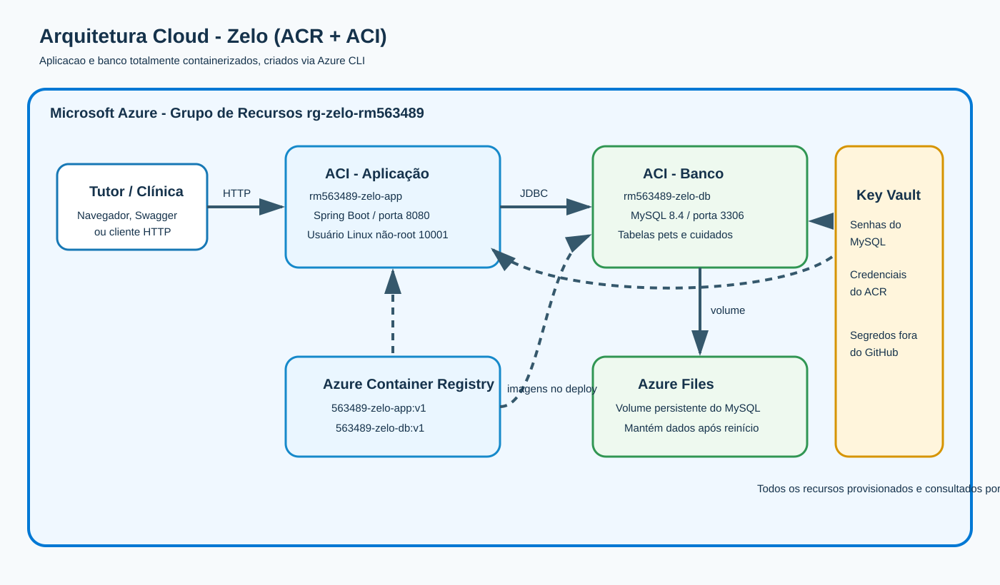

# Zelo - cuidado contínuo antes da urgência

API Java da Sprint 3 de DevOps Tools & Cloud Computing. Esta entrega adota exclusivamente a **Opção 1: Azure Container Registry (ACR) + Azure Container Instances (ACI)**. A aplicação Spring Boot e o banco MySQL são imagens Docker armazenadas no ACR e executadas em ACIs separados. Não há App Service nem banco PaaS.



## 1. Descrição da solução

O Zelo é um sistema de cuidado longitudinal que aproxima tutores e clínicas veterinárias. Neste MVP, a API mantém os pets acompanhados e seus cuidados preventivos, como vacinas, consultas, exames e medicamentos. As tabelas `pets` e `cuidados` representam o núcleo da solução, possuem relacionamento 1:N e oferecem inclusão, consulta, alteração e exclusão.

O projeto já inclui duas linhas significativas em cada tabela: os pets Thor e Luna e seus respectivos cuidados preventivos. A página inicial confirma o funcionamento, enquanto o Swagger UI permite testar visualmente todos os endpoints.

## 2. Benefícios para o negócio

O Zelo reduz o esquecimento de vacinas, retornos e exames, transformando o atendimento veterinário reativo em acompanhamento preventivo. Para o tutor, centraliza o histórico e deixa claras as próximas ações. Para a clínica, melhora a continuidade do relacionamento, fornece contexto para o atendimento e cria oportunidades de retorno no momento adequado. Para o pet, aumenta a chance de cuidados importantes acontecerem antes de uma urgência.

## 3. Arquitetura e funcionamento

| Recurso | Responsabilidade |
| --- | --- |
| ACR `zeloacr563489` | Armazena as imagens `563489-zelo-app:v1` e `563489-zelo-db:v1`. |
| ACI `rm563489-zelo-app` | Expõe a API Spring Boot na porta 8080 e executa como usuário Linux não privilegiado `10001`. |
| ACI `rm563489-zelo-db` | Executa MySQL 8.4 na porta 3306 e inicializa o DDL. |
| Azure Files | Monta um volume em `/var/lib/mysql`, preservando os registros após reinícios. |
| Azure Key Vault | Mantém senhas do banco e credenciais do ACR fora do código-fonte. |

Fluxo de funcionamento: o cliente acessa o FQDN público do ACI da aplicação; a API valida a requisição e usa JDBC para manipular o MySQL no ACI do banco; o banco grava os arquivos no volume Azure Files. No deploy, os dois ACIs obtêm suas imagens do ACR e os scripts recuperam os segredos do Key Vault.

## 4. Estrutura do projeto

```text
docker/app/Dockerfile             imagem da API com usuário não-root
docker/db/Dockerfile              imagem do MySQL com DDL inicial
scripts/                          criação, build, push, deploy, teste e exclusão
script_bd.sql                     DDL comentado das tabelas CORE e dados iniciais
docs/arquitetura-azure.svg        desenho da arquitetura cloud
docs/consultas-evidencia.sql      SELECTs para comprovação do CRUD
docs/roteiro-video.md             sequência recomendada da gravação
postman/                          coleção com GET, POST, PUT e DELETE
src/                              código-fonte Spring Boot
docker-compose.yml                validação local antes do envio à nuvem
```

## 5. Pré-requisitos

- Git, Docker Desktop, Azure CLI e uma assinatura Azure ativa;
- Bash (Git Bash, WSL ou terminal Linux);
- permissão para criar ACR, ACI, Storage e Key Vault;
- portas locais 8080 e 3306 livres para o teste local.

> Execute os comandos na raiz do repositório. Não crie nem envie um arquivo `.env` com senhas reais ao GitHub.


## 6. Clone obrigatório

O vídeo deve começar clonando o repositório em uma pasta ainda não utilizada:

```bash
git clone https://github.com/brunoferr10/zelo-devops.git
cd zelo-devops
```

## 7. Teste local antes da nuvem

```bash
cp .env.example .env
# Edite somente o .env local e defina senhas fortes.
docker compose up --build -d
docker compose ps
curl http://localhost:8080/actuator/health
curl http://localhost:8080/api/pets
curl http://localhost:8080/api/cuidados
```

Swagger local: `http://localhost:8080/swagger-ui.html`.

Para encerrar sem apagar o volume: `docker compose down`. Para apagar também os dados do teste local: `docker compose down -v`.

## 8. Deploy completo na Azure via CLI

### 8.1 Login e assinatura

```bash
az login
az account show --output table
# Se necessário:
# az account set --subscription "NOME-OU-ID-DA-ASSINATURA"
```

### 8.2 Segredos somente na sessão do terminal

Use valores próprios. Estes comandos não devem ser salvos com senhas preenchidas:

```bash
export MYSQL_ROOT_PASSWORD='SENHA_FORTE_DO_ROOT'
export MYSQL_USER='zelo_user'
export MYSQL_PASSWORD='SENHA_FORTE_DO_USUARIO'
```

### 8.3 Permissão e execução ordenada

```bash
chmod +x scripts/*.sh
./scripts/01-criar-recursos.sh | tee 01-criar-recursos.log
./scripts/02-build-push.sh     | tee 02-build-push.log
./scripts/03-deploy-banco.sh   | tee 03-deploy-banco.log
```

Confira os logs do banco e espere aparecer `ready for connections`:

```bash
az container logs --resource-group rg-zelo-rm563489 --name rm563489-zelo-db
```

Depois publique a aplicação:

```bash
./scripts/04-deploy-app.sh | tee 04-deploy-app.log
az container logs --resource-group rg-zelo-rm563489 --name rm563489-zelo-app
```

### 8.4 Recuperar URL e testar

```bash
APP_FQDN=$(az container show --resource-group rg-zelo-rm563489 \
  --name rm563489-zelo-app --query ipAddress.fqdn --output tsv)

curl "http://${APP_FQDN}:8080/actuator/health"
curl "http://${APP_FQDN}:8080/api/pets"
curl "http://${APP_FQDN}:8080/api/cuidados"
```

Swagger na nuvem: `http://FQDN-RETORNADO:8080/swagger-ui.html`.

## 9. CRUD completo

### Pets

```bash
# CREATE
curl -X POST "http://${APP_FQDN}:8080/api/pets" \
  -H "Content-Type: application/json" \
  -d '{"nome":"Mel","especie":"Cao","raca":"Beagle","dataNascimento":"2023-04-12","nomeTutor":"Carla Souza"}'

# READ geral e individual (substitua 3 pelo ID retornado)
curl "http://${APP_FQDN}:8080/api/pets"
curl "http://${APP_FQDN}:8080/api/pets/3"

# UPDATE
curl -X PUT "http://${APP_FQDN}:8080/api/pets/3" \
  -H "Content-Type: application/json" \
  -d '{"nome":"Mel","especie":"Cao","raca":"Beagle","dataNascimento":"2023-04-12","nomeTutor":"Carla Souza Ferreira"}'

# DELETE: execute somente depois de apagar o cuidado relacionado
curl -i -X DELETE "http://${APP_FQDN}:8080/api/pets/3"
```

### Cuidados

```bash
# CREATE relacionado ao pet 3
curl -X POST "http://${APP_FQDN}:8080/api/cuidados" \
  -H "Content-Type: application/json" \
  -d '{"petId":3,"tipo":"EXAME","descricao":"Hemograma preventivo anual","dataPrevista":"2026-11-05","status":"PENDENTE"}'

# READ geral, individual e filtrado por pet
curl "http://${APP_FQDN}:8080/api/cuidados"
curl "http://${APP_FQDN}:8080/api/cuidados/3"
curl "http://${APP_FQDN}:8080/api/cuidados?petId=3"

# UPDATE
curl -X PUT "http://${APP_FQDN}:8080/api/cuidados/3" \
  -H "Content-Type: application/json" \
  -d '{"petId":3,"tipo":"EXAME","descricao":"Hemograma preventivo realizado","dataPrevista":"2026-11-05","status":"CONCLUIDO"}'

# DELETE primeiro, por causa da chave estrangeira
curl -i -X DELETE "http://${APP_FQDN}:8080/api/cuidados/3"
```

O script `./scripts/05-testar-cloud.sh` automatiza criação, leitura e alteração e informa os IDs que devem ser usados na comprovação SQL. A exclusão fica manual para que possa ser evidenciada individualmente no vídeo.

## 10. Evidência direta no banco por SELECT

Recupere o IP do banco e abra o cliente MySQL dentro do ACI:

```bash
az container exec --resource-group rg-zelo-rm563489 \
  --name rm563489-zelo-db --exec-command "/bin/bash"

mysql -uzelo_user -p zelo
```

Digite a senha quando solicitada. Use as consultas de `docs/consultas-evidencia.sql`. No vídeo, a ordem obrigatória para **cada tabela** é:

1. POST na API e SELECT do registro inserido;
2. PUT na API e SELECT do registro alterado;
3. GET na API e SELECT de consulta;
4. DELETE na API e SELECT retornando zero linhas.

Apague primeiro `cuidados` e depois `pets`, pois a chave estrangeira protege a integridade do histórico.

## 11. Provas de infraestrutura

```bash
# Recursos criados
az resource list --resource-group rg-zelo-rm563489 --output table

# Imagens no ACR
az acr repository list --name zeloacr563489 --output table
az acr repository show-tags --name zeloacr563489 --repository 563489-zelo-app --output table
az acr repository show-tags --name zeloacr563489 --repository 563489-zelo-db --output table

# ACIs ativos
az container list --resource-group rg-zelo-rm563489 --output table

# Aplicação sem privilégio administrativo: deve mostrar uid=10001(zelo)
az container exec --resource-group rg-zelo-rm563489 \
  --name rm563489-zelo-app --exec-command "id"

# Logs
az container logs --resource-group rg-zelo-rm563489 --name rm563489-zelo-db
az container logs --resource-group rg-zelo-rm563489 --name rm563489-zelo-app
```

Para provar persistência, reinicie o ACI do banco e repita os SELECTs. O volume Azure Files continuará com os dados.

## 12. Exclusão dos recursos após a correção

Para evitar cobranças, execute somente depois de concluir todas as gravações e evidências:

```bash
./scripts/06-excluir-recursos.sh
```

## 13. Integrantes

- Hebert Lopes do Santos — RM 563192
- Nicolas Monteiro Ramiro — RM 562380
- Marcus Vinícius Vila Nova da Silva — RM 558771
- Bruno Ferreira — RM 563489
- Gabriel Robertoni Padilha — RM 566293

## 14. Checklist da entrega

- [x] Opção única ACR + ACI, sem mistura com App Service ou banco PaaS
- [x] Aplicação e banco containerizados
- [x] Recursos criados integralmente por Azure CLI
- [x] Aplicação executada como usuário não-root
- [x] MySQL permitido, com volume persistente em nuvem
- [x] `script_bd.sql` comentado, PK, FK e duas tabelas CORE relacionadas
- [x] Duas linhas significativas em cada tabela
- [x] CRUD completo de `pets` e `cuidados`
- [x] Dockerfiles, Compose, scripts, coleção Postman e comandos documentados
- [x] Arquitetura cloud com recursos e responsabilidades
- [x] Publicar o código no GitHub e conferir acesso público do professor
- [x] Gravar vídeo seguindo `docs/roteiro-video.md` e conferir acesso público
- [x] Gerar o PDF final contendo exclusivamente integrantes, link do GitHub e link do YouTube
